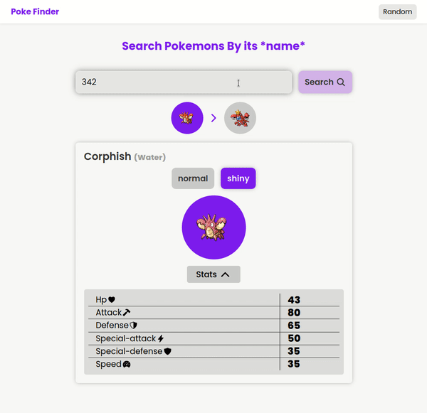

<h1 align="center"> 
Poke Finder
</h1>

### Descrição 📎

Poke Finder é uma site para busca de pokemons, no app o usuário pode ver as estatísticas e evoluções do dos pokemons. A aplicação foi construída com Vue e typescript.

<h3 align="center">

<a  href="https://poke-finder-nu.vercel.app/"/>

«Acessar Website»

</a>

</h3>

### Como Rodar 🚀

Para rodar em desenvolvimento basta baixar os arquivos do projeto via zip ou `git clone`. Após isso basta baixar as dependências e rodar o código em desenvolvimento:

```bash
> npm i
> npm run dev
```

### Preview 👓

<p align="center">

</p>

---

### Ferramentas Utilizadas 🛠️

<p align="center">
    
    
    
    
    
    
</p>

## Entre em contato 📞

<br>

<p align="center">
<a href="https://www.linkedin.com/in/luis-felipe-vanin-martins-5a5b38215">

</a>
<a href="mailto:luisfvanin2@gmail.com">

</a>
</p>
